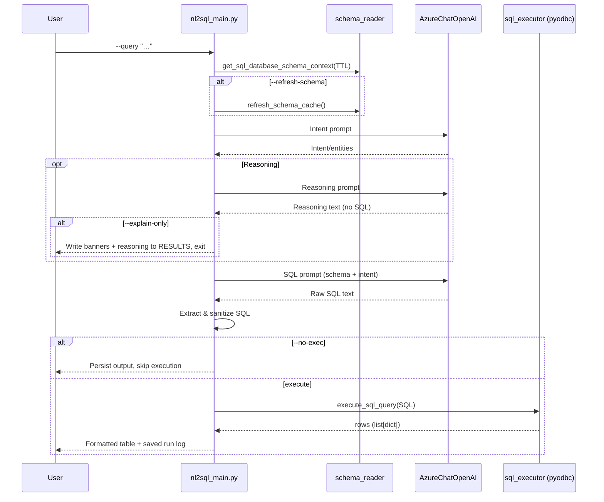

# NL2SQL Pipeline — End-to-End Flow

This document shows the current end-to-end flow of the NL2SQL-only pipeline, including CLI flags, schema cache behavior, LLM reasoning, SQL generation/execution, and output logging.

## Flowchart

```mermaid
flowchart TD
    %% Entry
    A[User NL Question] --> B[CLI parse\n--query, --no-exec, --no-reasoning, --explain-only, --refresh-schema]

    %% Environment
    subgraph ENV[Environment]
      E1[.env loaded\n(AZURE_OPENAI_*, AZURE_SQL_*)]
      E2[ODBC Driver 18 installed]
    end

    B --> C{--refresh-schema?}
    C -- yes --> C1[Refresh schema cache\nschema_reader.refresh_schema_cache()]
    C -- no --> D
    C1 --> D

    D[get_sql_database_schema_context\n(TTL 24h default)] --> E[Intent extraction\nLangChain -> AzureChatOpenAI]

    E --> F{Show reasoning?}
    F -- yes --> G[Reasoning summary\n(no SQL)]
    G --> H{--explain-only?}
    F -- no --> H

    H -- yes --> X[Persist banners + reasoning\nRESULTS/*.txt] --> Z[Exit]
    H -- no --> I[SQL generation\nSchema-aware prompt -> AzureChatOpenAI]

    I --> J[Extract & sanitize SQL]
    J --> K{--no-exec?}
    K -- yes --> X
    K -- no --> L[Execute SQL via pyodbc\nsql_executor.execute_sql_query()]
    L --> M[Format table output]
    M --> X

    subgraph ARTIFACTS[Artifacts]
      X[Write full run log\nAQ-NEW-NL2SQL/RESULTS/…]
      C1
    end

    %% Errors
    L -. error .-> ER[Print error banner\npersist to RESULTS] --> Z
```

Quick view (raw Mermaid):
- Flowchart: `docs/diagrams/nl2sql_flowchart.mmd`

## Sequence (optional)



Quick view (raw Mermaid):
- Sequence: `docs/diagrams/nl2sql_sequence.mmd`

## Key flags and behaviors

- `--refresh-schema`: refreshes the JSON schema cache before generation.
- `--no-reasoning`: skips printing the reasoning section.
- `--explain-only`: prints intent and reasoning only, then exits (no SQL generation/execution).
- `--no-exec`: generates SQL but does not execute it.

## Components and files

- Runner: `AQ-NEW-NL2SQL/nl2sql_main.py`
- Schema cache: `AQ-NEW-NL2SQL/schema_reader.py` → `AQ-NEW-NL2SQL/DATABASE_SETUP/schema_cache.json`
- SQL execution: `AQ-NEW-NL2SQL/sql_executor.py` (pyodbc)
- Outputs: `AQ-NEW-NL2SQL/RESULTS/`

## External services

- Azure OpenAI (chat completions) for intent/reasoning/SQL generation
- Azure SQL Database (ODBC Driver 18, pyodbc) for query execution

## Data lineage by question type

The diagram below maps common question categories to the typical views/tables involved. Prefer `dbo.vw_LoanPortfolio` for portfolio-style questions and join to detailed tables only when needed.

```mermaid
flowchart LR
  subgraph Q[Question types]
    q1[Portfolio overview<br/>(exposure by region/subregion)]
    q2[Rate/spread analysis]
    q3[Delinquency & payments]
    q4[Covenant compliance & risk]
    q5[Customer profiling]
    q6[Collateral valuation]
    q7[FX-normalized metrics]
  end

  subgraph S[Data sources (views/tables)]
    s1[(dbo.vw_LoanPortfolio)]
    s2[(dbo.Loan)]
    s3[(dbo.PaymentSchedule)]
    s4[(dbo.PaymentEvent)]
    s5[(dbo.Covenant)]
    s6[(dbo.CovenantSchedule)]
    s7[(dbo.CovenantTestResult)]
    s8[(dbo.RiskMetricHistory)]
    s9[(dbo.Company)]
    s10[(dbo.CustomerProfile)]
    s11[(dbo.CompanyAddress)]
    s12[(dbo.Collateral)]
    s13[(ref.Region)]
    s14[(ref.Subregion)]
    s15[(ref.Country)]
    s16[(ref.Currency)]
    s17[(ref.ReferenceRate)]
    s18[(ref.FXRateDaily)]
  end

  %% Portfolio overview
  q1 --> s1
  q1 --> s13
  q1 --> s14
  q1 --> s15
  q1 --> s16

  %% Rate/spread analysis
  q2 --> s1
  q2 --> s17

  %% Delinquency & payments
  q3 --> s2
  q3 --> s3
  q3 --> s4
  q3 --> s9

  %% Covenant compliance & risk
  q4 --> s5
  q4 --> s6
  q4 --> s7
  q4 --> s8
  q4 --> s2
  q4 --> s9

  %% Customer profiling
  q5 --> s9
  q5 --> s10
  q5 --> s11

  %% Collateral valuation
  q6 --> s12
  q6 --> s2
  q6 --> s16

  %% FX-normalized metrics
  q7 --> s1
  q7 --> s18
  q7 --> s16
```

Quick view (raw Mermaid):
- Data lineage: `docs/diagrams/nl2sql_data_lineage.mmd`

Notes
- Use `dbo.vw_LoanPortfolio` where possible to simplify joins across company/loan/region fields.
- Join `ref.FXRateDaily` when normalizing amounts across currencies; choose an appropriate as-of date.
- For interest-rate questions, consider weighting averages by `PrincipalAmount`.
