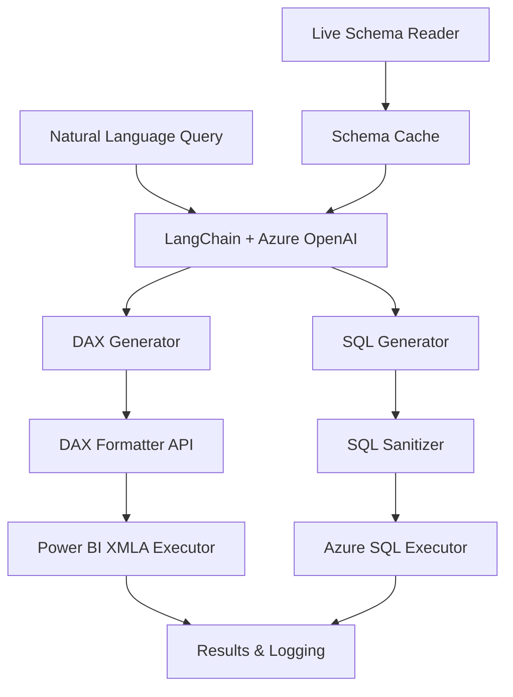
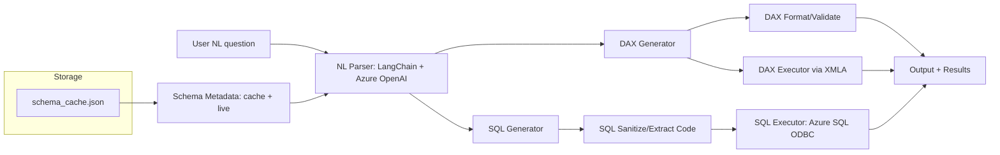
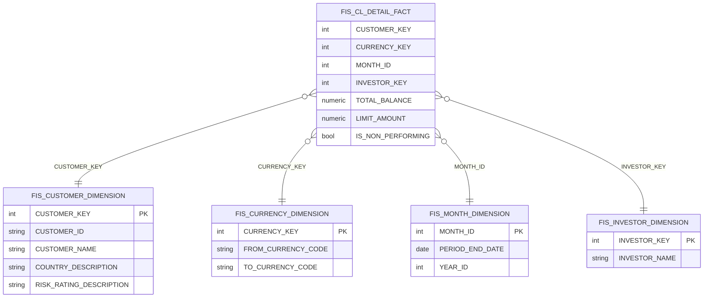
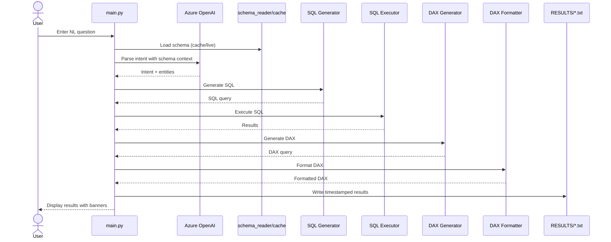
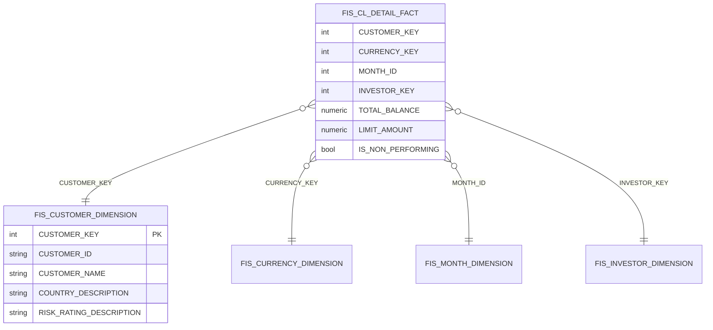

# NL2DAX - Natural Language to DAX/SQL Translation

[](https://opensource.org/licenses/MIT)
[](https://www.python.org/downloads/)
[](https://docs.microsoft.com/en-us/power-bi/developer/embedded/xmla-endpoint)

A comprehensive solution for translating natural language queries into DAX and SQL for Azure SQL Database and Power BI datasets. Built with LangChain, Azure OpenAI, and featuring schema awareness, robust error handling, and automated Power BI service principal setup.

## 🚀 Features

- **🗣️ Natural Language Processing**: Convert English questions to executable DAX and SQL queries
- **🧠 Schema Awareness**: Automatically reads database schema, relationships, and primary keys
- **🔄 Dual Output**: Generate both DAX (for Power BI) and SQL (for Azure SQL) from the same query
- **🛠️ Service Principal Management**: Automated setup for Power BI XMLA endpoint access
- **📊 Query Execution**: Execute SQL queries directly and display results
- **✨ DAX Formatting**: Integration with DAX Formatter API for clean, readable DAX
- **🔍 Comprehensive Diagnostics**: Tools to verify and troubleshoot Power BI connectivity
- **📝 Result Logging**: Automatic timestamped result files for audit and review

## 📁 Repository Structure

```
NL2DAX/
├── 📂 CODE/                    # Core application code and diagnostic tools
├── 📂 NOTEBOOKS/               # Jupyter notebooks for Power BI REST API examples
├── 📂 RESULTS/                 # Generated query results and logs
├── 📂 TEST QUESTIONS/          # Sample questions for testing
├── 📂 docs/                    # Documentation and diagrams
├── 📂 scripts/                 # Setup and troubleshooting scripts
├── 📂 EDUCATIONAL_STUFF/       # Learning materials and comparisons
├── 📂 From Jason/              # External documentation and setup guides
├── 🔧 .env.template           # Environment variables template
├── 📋 requirements.txt        # Python dependencies
└── 📖 README.md               # This file
```

## 🏗️ Architecture

The system follows a modular architecture with clear separation of concerns:



## 🔧 Quick Start

### Prerequisites

- Python 3.8 or higher
- Azure OpenAI service access
- Azure SQL Database
- Power BI Premium workspace (for DAX execution)

### Installation

1. **Clone the repository**
   ```bash
   git clone https://github.com/Arturo-Quiroga-MSFT/NL2DAX.git
   cd NL2DAX
   ```

2. **Create virtual environment**
   ```bash
   python -m venv .venv
   source .venv/bin/activate  # On Windows: .venv\Scripts\activate
   ```

3. **Install dependencies**
   ```bash
   pip install -r requirements.txt
   ```

4. **Configure environment**
   ```bash
   cp .env.template .env
   # Edit .env with your credentials (see Configuration section)
   ```

5. **Test the setup**
   ```bash
   # Test basic functionality
   python CODE/main.py
   
   # Test Power BI connectivity (if configured)
   python CODE/smoke_test_xmla.py
   ```

## DAX Formatter API

- The DAX Formatter API is used for formatting and validating DAX queries.
- **No API key is required.**
- If you receive HTTP 404 errors, the service may be temporarily unavailable or the endpoint may have changed. Check https://www.daxformatter.com/api/daxformatter/ in your browser to verify availability.

## Troubleshooting

- **DAX Formatter API errors:**
	- No API key is needed. If you get HTTP 404, check your internet connection and the DAX Formatter service status.
- **Azure SQL connection errors:**
	- Ensure your `.env` file is correctly configured with server, DB, user, and password.
- **Schema not updating:**
	- Run `python schema_reader.py --cache` to refresh the schema cache.

## License
MIT

# NL2DAX
Natural Language to DAX and SQL pipeline for Azure SQL DB with schema awareness, robust error handling, and clear output formatting.

## What is NL2DAX?

NL2DAX converts natural-language questions into DAX (and SQL) queries against your governed data models. It combines:
- An LLM for language understanding
- Live schema awareness (tables, columns, relationships)
- Generation of executable queries
- Optional DAX validation/formatting
- Execution and results reporting

The goal is to let users ask business questions in plain English while the system produces correct, context-aware queries.

## Why it matters

- Democratizes analytics: non-technical users can self-serve without learning DAX/SQL
- Speed and consistency: reduce back-and-forth with data teams; reuse governed logic
- Schema awareness: align to your actual star schema and reduce errors
- Dual output (DAX + SQL): serve BI and operational analytics in one workflow

## Common use cases

- Self-serve analytics in Power BI: “Top 10 counterparties by exposure” → DAX measure/table
- Finance and risk reporting: “NPL ratio by region and rating band”
- Operational insights from Azure SQL: “Average balance per customer by currency”
- Data validation and migration: generate DAX and equivalent SQL to cross-check results
- Ad-hoc exploration: analysts iterate questions rapidly with governed metadata

## High-level architecture (NL → DAX/SQL → Results)



Notes:
- DAX execution requires a Tabular engine (Power BI XMLA / AAS / SSAS). On macOS, use XMLA remotely with pyadomd.
- SQL execution runs directly against Azure SQL via ODBC.

## Star schema (example)




## ⚙️ Configuration

### Environment Variables

Create a `.env` file in the `CODE/` directory with the following variables:

```bash
# Azure OpenAI Configuration
AZURE_OPENAI_ENDPOINT=https://your-openai-resource.openai.azure.com/
AZURE_OPENAI_API_KEY=your-openai-api-key
AZURE_OPENAI_DEPLOYMENT_NAME=gpt-4o-mini
AZURE_OPENAI_API_VERSION=2023-05-15

# Azure SQL Database Configuration
SQL_SERVER=your-server.database.windows.net
SQL_DATABASE=your-database-name
SQL_USERNAME=your-username
SQL_PASSWORD=your-password
ODBC_DRIVER=ODBC Driver 18 for SQL Server

# Power BI Configuration (for DAX execution)
POWER_BI_CLIENT_ID=your-service-principal-client-id
POWER_BI_CLIENT_SECRET=your-service-principal-secret
POWER_BI_TENANT_ID=your-azure-tenant-id
POWER_BI_WORKSPACE_ID=your-powerbi-workspace-id
POWER_BI_DATASET_ID=your-powerbi-dataset-id
XMLA_CONNECTION_STRING=Provider=MSOLAP;Data Source=powerbi://api.powerbi.com/v1.0/myorg/YourWorkspace;...

# Optional Configuration
DAX_FORMATTER_SERVER=https://www.daxformatter.com
LOG_LEVEL=INFO
```

### Power BI Service Principal Setup

For Power BI connectivity, you'll need to set up a service principal:

1. **Create the service principal** (use our automated script):
   ```bash
   # Run the PowerShell setup script
   ./scripts/create_service_principal.ps1
   ```

2. **Enable XMLA endpoints** (admin required):
   ```bash
   # Enable XMLA in Power BI admin portal
   ./scripts/enable_xmla_endpoints.ps1
   ```

3. **Verify permissions**:
   ```bash
   # Test service principal connectivity
   python CODE/diagnose_permissions.py
   ```

## 📖 Usage Guide

### Basic Query Execution

```bash
cd CODE
python main.py
```

**Example session:**
```
=== 🤖 Welcome to NL2DAX ===
Enter your question (or 'exit' to quit): What are the top 5 customers by balance?

=== Generated DAX Query ===
EVALUATE
TOPN(
    5,
    SUMMARIZE(
        FIS_CUSTOMER_DIMENSION,
        FIS_CUSTOMER_DIMENSION[CUSTOMER_NAME],
        "TotalBalance", SUM(FIS_CL_DETAIL_FACT[TOTAL_BALANCE])
    ),
    [TotalBalance],
    DESC
)

=== Generated SQL Query ===
SELECT TOP 5
    c.CUSTOMER_NAME,
    SUM(f.TOTAL_BALANCE) as TotalBalance
FROM FIS_CUSTOMER_DIMENSION c
INNER JOIN FIS_CL_DETAIL_FACT f ON c.CUSTOMER_KEY = f.CUSTOMER_KEY
GROUP BY c.CUSTOMER_NAME
ORDER BY TotalBalance DESC;

=== SQL Execution Results ===
[Query results displayed in table format]
```

### Schema Exploration

```bash
# View complete schema
python CODE/schema_reader.py

# Update schema cache
python CODE/schema_reader.py --cache

# Test database connectivity
python CODE/db_connection_check.py
```

### Power BI Diagnostics

```bash
# Comprehensive permission check
python CODE/diagnose_permissions.py

# Quick XMLA status check
python CODE/xmla_status_check.py

# Simple smoke test
python CODE/smoke_test_xmla.py
```

### Advanced Usage

```bash
# Individual module testing
python CODE/dax_generator.py
python CODE/sql_executor.py
python CODE/query_executor.py

# DAX formatting
python CODE/dax_formatter.py
```

### Jupyter Notebooks

Explore the interactive examples in the `NOTEBOOKS/` directory:

- `PowerBI_RESTAPI_DAX_Query_Example.ipynb`: REST API examples
- `PowerBI_RESTAPI_DAX_Query_Example2.ipynb`: Advanced scenarios

## 🔍 Troubleshooting

### Common Issues

1. **Authentication Errors**
   ```bash
   # Verify service principal permissions
   python CODE/diagnose_permissions.py
   ```

2. **XMLA Connection Issues**
   ```bash
   # Check XMLA endpoint status
   python CODE/xmla_status_check.py
   ```

3. **SQL Connection Problems**
   ```bash
   # Test database connectivity
   python CODE/db_connection_check.py
   ```

### Error Messages

| Error | Solution |
|-------|----------|
| `401 Unauthorized` | Check service principal credentials and permissions |
| `XMLA endpoint not found` | Verify XMLA endpoints are enabled in Power BI admin portal |
| `Database connection failed` | Check SQL server credentials and firewall settings |
| `Schema cache empty` | Run `schema_reader.py --cache` to rebuild cache |
| `DAX Formatter HTTP 404` | Check internet connection and service availability |

### DAX Formatter API Notes

- The DAX Formatter API requires no API key
- If you receive HTTP 404 errors, the service may be temporarily unavailable
- Check https://www.daxformatter.com/api/daxformatter/ in your browser to verify availability

## 🏗️ Architecture Deep Dive

### High-Level Flow



### Star Schema Example



## 🎯 Best Practices

### Writing Effective Natural Language Queries

- **Be explicit**: Include metric, aggregation, grain, filters, and time window
- **Use business terms**: Align with dimension and measure names in your model
- **Start simple**: Begin with single dimensions, add complexity incrementally
- **Cross-validate**: Compare DAX and SQL outputs for consistency

**Good examples:**
- "Top 10 customers by total balance"
- "NPL ratio percentage by country and risk rating"
- "Average balance per customer for Q4 2023"

**Avoid vague queries:**
- "Show me data"
- "What's the performance?"

## 📁 Directory Structure

| Directory | Purpose | Key Files |
|-----------|---------|-----------|
| `CODE/` | Core application code | `main.py`, `dax_generator.py`, `sql_executor.py` |
| `NOTEBOOKS/` | Jupyter examples | Power BI REST API demonstrations |
| `RESULTS/` | Query outputs | Timestamped result files |
| `scripts/` | Setup & troubleshooting | PowerShell automation scripts |
| `docs/` | Documentation | Architecture diagrams, images |
| `TEST QUESTIONS/` | Sample queries | Pre-built test cases |

## 🤝 Contributing

1. Fork the repository
2. Create a feature branch (`git checkout -b feature/amazing-feature`)
3. Commit your changes (`git commit -m 'Add some amazing feature'`)
4. Push to the branch (`git push origin feature/amazing-feature`)
5. Open a Pull Request

### Development Setup

```bash
# Clone and setup development environment
git clone https://github.com/Arturo-Quiroga-MSFT/NL2DAX.git
cd NL2DAX
python -m venv .venv
source .venv/bin/activate
pip install -r requirements.txt -r CODE/requirements.txt
```

## 📄 License

This project is licensed under the MIT License - see the [LICENSE](LICENSE) file for details.

## 🙏 Acknowledgments

- Microsoft Power BI team for XMLA endpoint support
- DAX Formatter API for query beautification
- Azure OpenAI for natural language processing capabilities
- LangChain community for NLP framework support

## 📞 Support

- 🐛 **Issues**: [GitHub Issues](https://github.com/Arturo-Quiroga-MSFT/NL2DAX/issues)
- 📖 **Documentation**: [Wiki](https://github.com/Arturo-Quiroga-MSFT/NL2DAX/wiki)
- 💬 **Discussions**: [GitHub Discussions](https://github.com/Arturo-Quiroga-MSFT/NL2DAX/discussions)

---

<div align="center">
Made with ❤️ by <a href="https://github.com/Arturo-Quiroga-MSFT">Arturo Quiroga</a>
</div>
