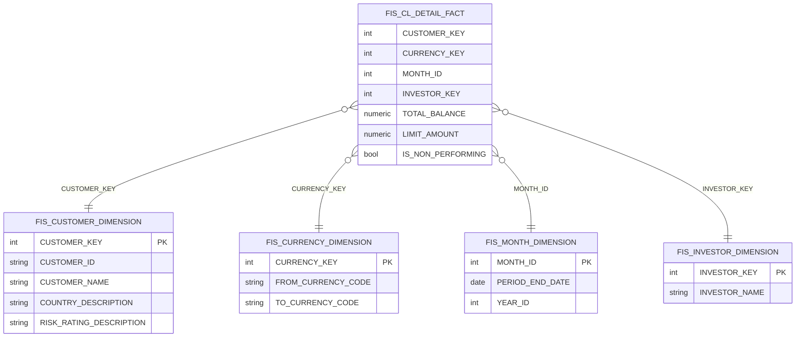
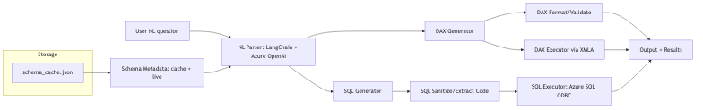
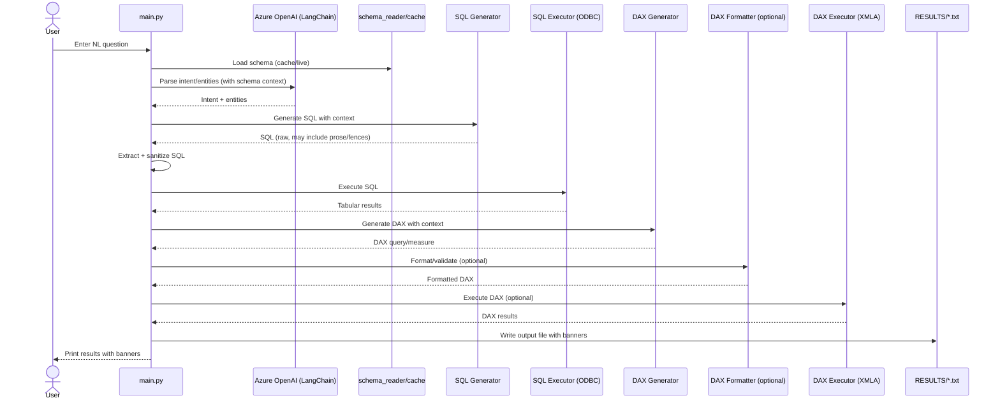
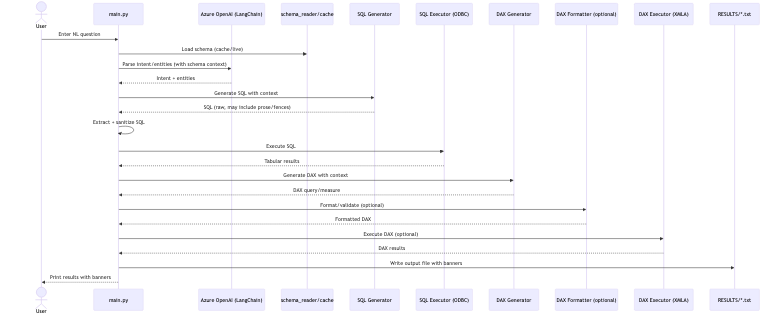

# NL2DAX & NL2SQL for Azure SQL DB


This project translates natural language queries into DAX or SQL for Azure SQL DB using LangChain and Azure OpenAI. It features schema awareness, robust error handling, and clear output formatting.

## Repository Structure

```
NL2DAX/
├── .github/
│   └── copilot-instructions.md
├── .vscode/
│   └── settings.json
├── CODE/
│   ├── .env
│   ├── .env.example
│   ├── .gitignore
│   ├── dax_formatter.py
│   ├── dax_generator.py
│   ├── db_connection_check.py
│   ├── main.py
│   ├── query_executor.py
│   ├── requirements.txt
│   ├── schema_cache.json
│   ├── schema_reader.py
│   └── sql_executor.py
├── RESULTS/
│   ├── nl2dax_run_List_the_average_balance_per_customer_by_20250806_142122.txt
│   ├── nl2dax_run_List_the_average_balance_per_customer_by_20250806_143722.txt
│   ├── nl2dax_run_List_the_top_5_customers_by_total_credit_20250806_140837.txt
│   ├── nl2dax_run_List_the_top_5_customers_by_total_credit_20250806_141144.txt
│   ├── nl2dax_run_List_top_10_counterparties_by_total_expo_20250806_132203.txt
│   ├── nl2dax_run_List_top_10_counterparties_by_total_expo_20250806_133940.txt
│   ├── nl2dax_run_Show_the_NPL_ratio_percentage_by_region__20250806_131708.txt
│   ├── nl2dax_run_Show_the_NPL_ratio_percentage_by_region__20250806_132806.txt
│   ├── nl2dax_run_Show_total_exposure_USD_by_risk_rating_c_20250806_132031.txt
│   ├── nl2dax_run_What_is_the_total_principal_balance_for__20250806_133348.txt
│   └── nl2dax_run_What_is_the_total_principal_balance_for__20250806_133651.txt
├── TEST QUESTIONS/
│   └── nl2dax_star_schema_test_questions.txt
├── __pycache__/
│   └── *.pyc
├── README.md
```


## Setup
- Configure your Azure OpenAI credentials and Azure SQL DB connection in `.env`.
- Install dependencies: `pip install -r requirements.txt`


## Features
- **NL2DAX**: Generate DAX queries from natural language.
- **NL2SQL**: Generate SQL queries from natural language.
- **SQL Execution**: Run generated SQL queries and display results as tables.
- **Schema Awareness**: Reads schema, relationships, and primary keys for accurate query generation.
- **Clear Output**: Results and sections are separated by ASCII banners for readability.
- **DAX Formatting**: Uses the public DAX Formatter API (no API key required).
- **Error Handling**: Robust error and exception handling throughout the pipeline.


## Usage

1. **Run the main pipeline:**
	 ```bash
	 python main.py
	 ```
	 - Input a natural language question. The system will generate DAX and SQL, execute SQL, and print results with clear banners.

2. **View schema summary:**
	 ```bash
	 python schema_reader.py
	 ```
	 - Prints a detailed summary of tables, columns, primary keys, and relationships.

3. **Update schema cache:**
	 ```bash
	 python schema_reader.py --cache
	 ```
	 - Refreshes the local schema cache from the database.

## DAX Formatter API

- The DAX Formatter API is used for formatting and validating DAX queries.
- **No API key is required.**
- If you receive HTTP 404 errors, the service may be temporarily unavailable or the endpoint may have changed. Check https://www.daxformatter.com/api/daxformatter/ in your browser to verify availability.

## Troubleshooting

- **DAX Formatter API errors:**
	- No API key is needed. If you get HTTP 404, check your internet connection and the DAX Formatter service status.
- **Azure SQL connection errors:**
	- Ensure your `.env` file is correctly configured with server, DB, user, and password.
- **Schema not updating:**
	- Run `python schema_reader.py --cache` to refresh the schema cache.

## License
MIT

# NL2DAX
Natural Language to DAX and SQL pipeline for Azure SQL DB with schema awareness, robust error handling, and clear output formatting.

## What is NL2DAX?

NL2DAX converts natural-language questions into DAX (and SQL) queries against your governed data models. It combines:
- An LLM for language understanding
- Live schema awareness (tables, columns, relationships)
- Generation of executable queries
- Optional DAX validation/formatting
- Execution and results reporting

The goal is to let users ask business questions in plain English while the system produces correct, context-aware queries.

## Why it matters

- Democratizes analytics: non-technical users can self-serve without learning DAX/SQL
- Speed and consistency: reduce back-and-forth with data teams; reuse governed logic
- Schema awareness: align to your actual star schema and reduce errors
- Dual output (DAX + SQL): serve BI and operational analytics in one workflow

## Common use cases

- Self-serve analytics in Power BI: “Top 10 counterparties by exposure” → DAX measure/table
- Finance and risk reporting: “NPL ratio by region and rating band”
- Operational insights from Azure SQL: “Average balance per customer by currency”
- Data validation and migration: generate DAX and equivalent SQL to cross-check results
- Ad-hoc exploration: analysts iterate questions rapidly with governed metadata

## High-level architecture (NL → DAX/SQL → Results)

```mermaid
flowchart LR
		U[User NL question] --> P[NL Parser<br/>LangChain + Azure OpenAI]
		S[Schema Metadata<br/>cache + live] --> P
		P -->|Intent + Entities| G1[DAX Generator]
		P -->|Intent + Entities| G2[SQL Generator]
		G1 --> FMT[DAX Format/Validate (optional)]
		G2 --> SAN[SQL Sanitize/Extract Code]
		FMT --> OUT[Output + RESULTS/*.txt]
		SAN --> SQLX[SQL Executor<br/>Azure SQL ODBC]
		SQLX --> OUT
		G1 -->|DAX (optional)| DAXX[DAX Executor via XMLA]
		DAXX --> OUT
		subgraph Storage
			CSH[schema_cache.json]
		end
		CSH --> S
```

Notes:
- DAX execution requires a Tabular engine (Power BI XMLA / AAS / SSAS). On macOS, use XMLA remotely with pyadomd.
- SQL execution runs directly against Azure SQL via ODBC.

## Star schema (example)



Rendered image:


## Pipeline flow (detailed)



## Tips for accurate NL2DAX/NL2SQL

- Be explicit: include metric, aggregation, grain, filters, and time window
- Name entities in business terms that map to dimensions/measures
- Align with model grain: measures aggregate facts; visuals slice by dimensions
- Validate incrementally: start with a single dimension and add more
- Cross-check: compare DAX and SQL outputs for the same logic when possible

## Adding images (optional)

To include screenshots or exported diagrams:
- Create a folder `docs/images/` and add PNG/SVG files.
- Reference them in the README:
  - ``
  - ``

GitHub renders Mermaid diagrams natively; no extra setup required.

## Quickstart

```bash
# 1) Create and activate a virtual environment (optional but recommended)
python -m venv .venv
source .venv/bin/activate

# 2) Install dependencies
pip install -r CODE/requirements.txt

# 3) Configure environment
cp CODE/.env.example CODE/.env
# Edit CODE/.env with your Azure OpenAI and Azure SQL settings

# 4) Run the pipeline
python CODE/main.py

# 5) Optional: View schema summary
python CODE/schema_reader.py
```

Rendered image:


## Configuration

| Variable | Description | Example |
|---|---|---|
| AZURE_OPENAI_API_KEY | Azure OpenAI API key | sk-... |
| AZURE_OPENAI_ENDPOINT | Azure OpenAI endpoint URL | https://your-openai-resource.openai.azure.com/ |
| AZURE_OPENAI_DEPLOYMENT_NAME | Chat model deployment name | gpt-4o-mini |
| SQL_SERVER | Azure SQL server hostname | yourserver.database.windows.net |
| SQL_DATABASE | Database name | yourdb |
| SQL_USERNAME | SQL auth username (or use AAD) | sqluser |
| SQL_PASSWORD | SQL auth password | secret |
| ODBC_DRIVER | ODBC driver name | ODBC Driver 18 for SQL Server |
| XMLA_CONNECTION_STRING | Tabular XMLA connection (optional for DAX) | Provider=MSOLAP;Data Source=... |

All variables live in `CODE/.env`.

## Exporting diagrams to images (optional)

To generate PNG/SVG from the Mermaid diagrams in this README:

```bash
npm install -g @mermaid-js/mermaid-cli
chmod +x docs/export-diagrams.sh
./docs/export-diagrams.sh
```

Images will be written to `docs/images/` and can be referenced as:

```markdown



```

Rendered image:

